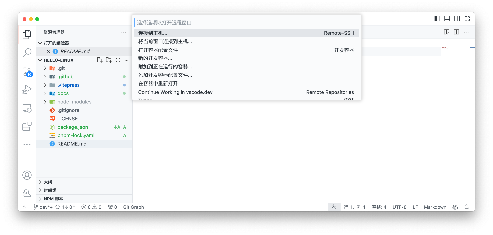
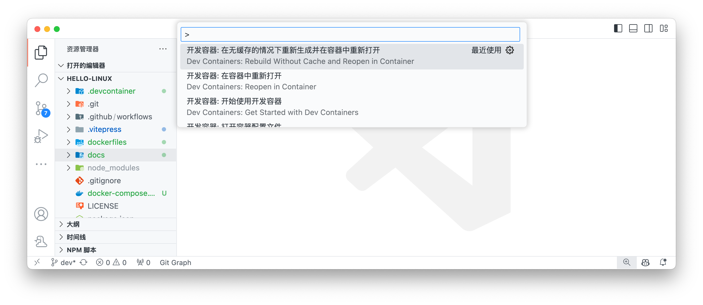

# 在容器中开发

## 启动容器

- **方式一**：在左下角启动按钮中选择 `Reopen in Container`  
  

- **方式二**：在**命令面板**中搜索并执行命令 `Dev Containers: Open Container Configuration File` 打开容器配置文件

特别是当修改了 Docker 镜像文件、配置文件后，需要重新启动容器时，可以通过这种方式重新启动容器。

> [!TIP]
> 在 VSCode 中键入 `Ctrl+Shift+P` 调出**命令面板** ，或者在菜单栏中选择 `查看(View)` -> `命令面板(Command Palette)` 调出**命令面板**
